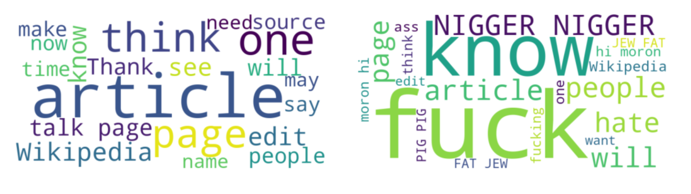

# Toxic Comment Classification with BERT

Implementation of the BERT (Devlin et al., 2019) architecture, inlcuding the attention-mechanism, to classify toxic comments. The data comes from the 2017 Kaggle toxic comment classification challenge (https://www.kaggle.com/c/jigsaw-toxic-comment-classification-challenge) (Jeffrey et al., 2017). It is a classification task, requiring to assign multiple labels for seven types of toxicity (including ”non-toxic”) to the comments.BERT was fine-tuned in the toxic comment classification downstream task; pretrained weights where used instead of a regular pretraining. 

## Run the program
1.  Create virtual environment and actiavte it:
    ```bash
    python3 -m venv .venv
    source .venv/bin/activate
    pip install -U pip
    ```
2.  Install dependencies:
    ```bash
    pip install -r requirements.txt
    ```
3.  Ensure dataset path `TOXIC` is configures in `params.py` and is pointing to the folder containing the CSV-files.
    Set `OUTPUT` as needed. Set the learning rate scheduling in `METHOD` and the rest of the hyperparameters in `params.py`.
4.  Run:

    **Training and evaluation**
    ```bash
    python main.py train
    ```
    **XAI (Integrated Gradients) on samples in `SAMPLES`**
    ```bash
    python main.py explain
    ```
5.  Output
    Results are written to the specified `OUTPUT` directory.

## Optional: Generate plots
In `main.py` uncomment the desired lines, for instance:
```python
show(TOXIC + 'train.csv', graph_name="dstr_toxic")  # plots without saving
show((TOXIC + 'train.csv'), output_folder=OUTPUT, graph_name="dstr_toxic")  # plots and saves in OUTPUT
```
## Credits:
Devlin, J., Chang, M.-W., Lee, K., & Toutanova, K. (2019). **BERT: Pre-training of Deep Bidirectional Transformers for Language Understanding.** NAACL-HLT. https://aclanthology.org/N19-1423/

Kaggle / Jigsaw (2017). **Toxic Comment Classification Challenge.** https://www.kaggle.com/c/jigsaw-toxic-comment-classification-challenge

